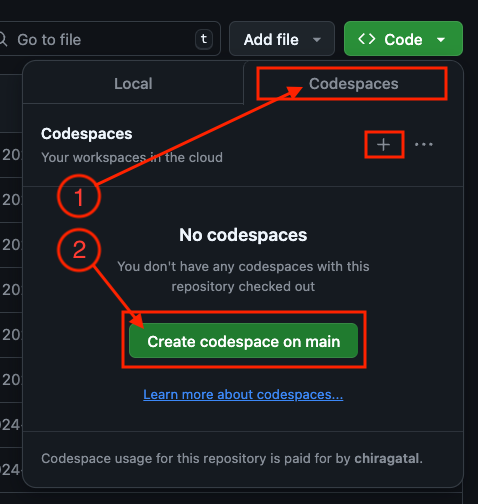
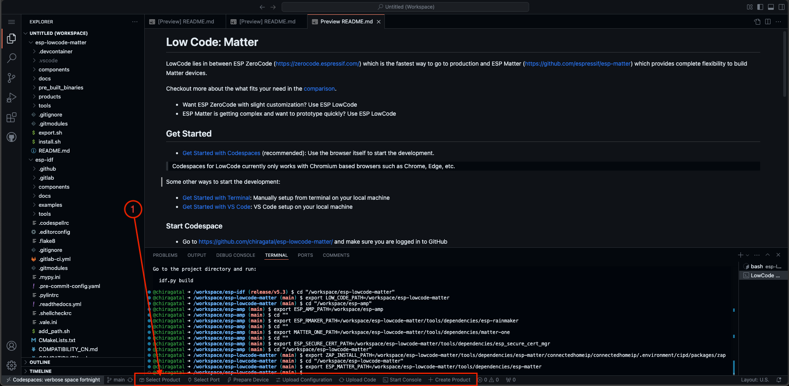
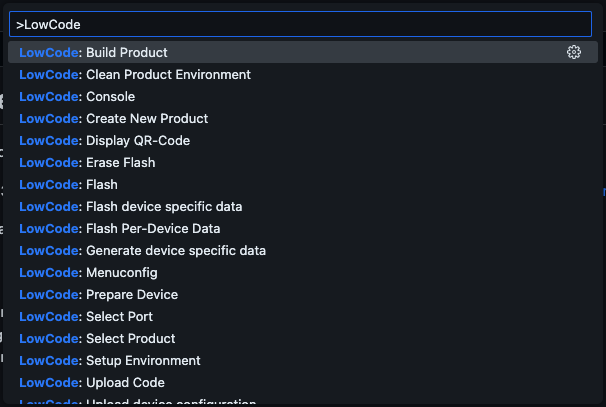

# ESP LowCode: Matter

ESP LowCode for Matter helps you build Matter devices quickly and easily and in a very lightweight way.

TODO

This is currently only supported on ESP32-C6. We are working on supporting other ESP32 series as well. Checkout more in [discussions](https://github.com/chiragatal/esp-lowcode-matter/discussions).

LowCode offers several key features that make the development and getting started quick and easy:

* No host setup required
* Develop directly in your browser
* Lightweight implementation with minimal overhead
* Simple Arduino-like programming model for ease of use
* Full Matter certification while maintaining simplicity

## Get Started

With LowCode you can easily edit, build, flash and debug your device in the browser itself using GitHub [Codespaces](#open-codespace). It is basically VS Code in the browser.

> Codespaces for LowCode currently only works with Chromium based browsers such as Chrome, Edge, etc.

Alternatively, you can also develop using local [terminal](./docs/getting_started_terminal.md) or local [VS Code](./docs/getting_started_vscode.md) on your host machine.

### Open Codespace

This will launch the web VS Code in the browser and get all the required dependencies, toolchains, repositories and setup the environment for you to start developing.

* Go to <https://github.com/chiragatal/esp-lowcode-matter/> and make sure you are logged in to GitHub
* Click on the green "Code" button -> Codespaces -> Create Codespace on Main (+)
* This might take about **5 minutes** to setup
* In the process, the codespace will **restart** a few times

Now you should be able to see the full fledged VS Code. There should be files and folders present in the left panel and the terminal and the output windows on the bottom. There should also be a status bar at the bottom with some buttons for LowCode.

### Start Development

Out of the box, LowCode offers some products in `esp-lowcode-matter/products` folder. Start by clicking the "Select Product" button on the **bottom of the screen (status bar)**.

The subsequent development steps are aligned in a sequence of buttons to take you through the process. Just click on the buttons from left to right.

There are also Codespaces commands (ctrl/cmd + shift + p) available with **"Lowcode:"** prefix for the same.

* **Select Product**: Start by selecting the product that you want to create which will also open the product code
* **Select Port**: Connect your **esp32c6** board to your computer via USB, and select the port
* **Prepare Device**: This will erase the flash on the device and flash the prebuilt binaries to your esp32c6 board
* **Upload Configuration**: This will generate the required device certificates and the qr code for the device and flash them to the device
* **Upload Code**: This will build, flash and run the code on the device

Once you have followed these steps, you now have a fully functional Matter Product. You can directly start using this through Ecosystems like Amazon, Apple, Google, Home Assistant, Samsung: [Device setup and control](./docs/device_setup.md)

## Next Steps

For additional information, you can refer to the following:

* [Create and customize your own product](./docs/create_product.md)
* [Product Configuration](./docs/product_configuration.md)
* [Programmer's model](./docs/programmer_model.md)
* [Debugging](./docs/debugging.md)

## More

### Other Commands

Some other commands (ctrl/cmd + shift + p) to help with development:

* **Build**: Build the selected product
* **Flash**: Flash the built product to your esp32c6 board
* **Console**: Open the device console to view the logs
* **Erase Flash**: Erase the flash storage
* **Menuconfig**: Open the menuconfig for the selected product
* **Product Clean**: Clean the build system

### Other Solutions

All of this is about ESP LowCode, but you can also checkout the following. Do you:

* Need something even simpler with basic customization? You can use [ESP ZeroCode](https://zerocode.espressif.com/) instead. BTW, this is the fastest way to go to production and launch your product.
* Need more flexibility and customization? You can use [ESP Matter](https://github.com/espressif/esp-matter) instead.

Checkout the differences between all these solutions in the [comparison](./docs/matter_solutions.md).

## Related Documents

* [Device Setup](./docs/device_setup.md)
* [Create LowCode Product](./docs/create_product.md)
* [Matter Solutions](./docs/matter_solutions.md)
* [Programmer's Model](./docs/programmer_model.md)
* [All Documents](./docs/all_documents.md)
