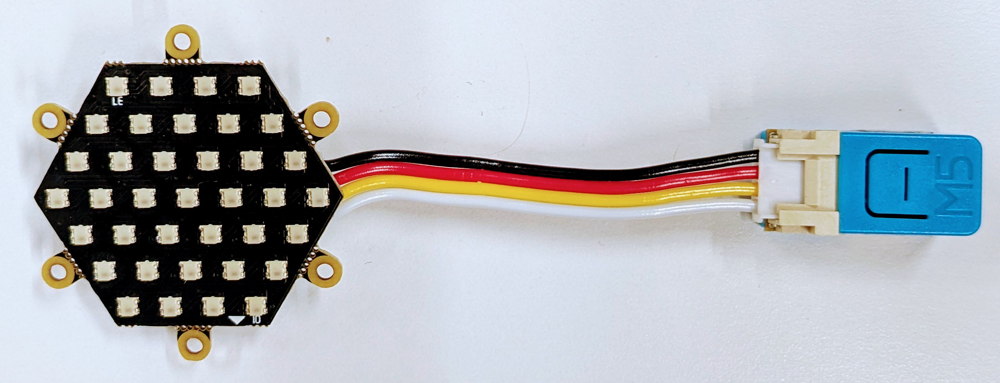

# Light (RMT Driver) | RGBCW | WS2812

## Description

A full-color RGB light featuring WS2812 LED control with comprehensive color management:

* **RGB LED Control**: Full color spectrum control via WS2812 addressable LED
* **Color Management**:
  * Hue control (0-360°)
  * Saturation adjustment (0-100%)
  * Brightness control (0-100%)
  * Color temperature adjustment (1,000,000K to 15.32K)
* **Device Status Indicator**: Provides system status indication through dynamic light effects
* **Matter Data Model Specification**:
  * **Device Type**: `Color Temperature Light`
  * **Additional Features**: `Hue-Saturation`

## Hardware Configuration

The following hardware components are used for this product:

* **Devkit**: [M5Stack Nano C6 Dev Kit](https://shop.m5stack.com/products/m5stack-nanoc6-dev-kit?srsltid=AfmBOooXsbm_fgpDyK1yWqgPOwtjrL3WksxGlhmRKDZFmVj2omLLbWDX)
* **LED Strip**: WS2812 addressable RGB LED
* **Power Supply**: Appropriate power source for LED strip

### Pin Assignment

| Peripheral       | GPIO Pin | Function                |
|------------------|----------|-------------------------|
| WS2812 Control   | GPIO8    | LED data line control   |

> **Note**: GPIO assignment can be customized by modifying the following macro in **app_driver.cpp**:
> `WS2812_CTRL_IO`

## Understanding Code

### Initialization Sequence

The `app_driver_init()` function performs the following:

* Configures WS2812 LED control GPIO, which internally initializes the RMT (Remote Control) peripheral driver.
* Initializes the light driver with:
  * Device type: `LIGHT_DEVICE_TYPE_WS2812`
  * Channel combination: `LIGHT_CHANNEL_COMB_3CH_RGB`
  * Brightness range: 0-100%
* Sets default values:
  * Power state: ON
  * Hue: 100°
  * Saturation: 100%
  * Brightness: 100%

### Core Functions

* **Light Control**:
  * `app_driver_set_light_state`: Controls power state (true=ON, false=OFF)
  * `app_driver_set_light_brightness`: Sets brightness level (0-255 mapped to 0-100%)
  * `app_driver_set_light_hue`: Adjusts hue (0-255 mapped to 0-360°)
  * `app_driver_set_light_saturation`: Adjusts saturation (0-255 mapped to 0-100%)
  * `app_driver_set_light_temperature`: Sets color temperature (1,000,000 K to 15.32 K)

* **Visual Indicators**:
  * `LOW_CODE_EVENT_SETUP_MODE_START`: starts blinking effect, to indicate setup mode activation (2000ms interval)
  * `LOW_CODE_EVENT_SETUP_MODE_END`: stops blinking effect, to indicate setup mode has ended.
  * `LOW_CODE_EVENT_READY`: displays full brightness white light to indicate device is ready

### Extending Functionality

To add physical button interaction to control the RGB light:

* Initialize GPIO button(s) in `app_driver_init()`
* Implement callbacks for:
  * Single press: Toggle power state
  * Long press: Cycle through color modes
* Register callbacks using `button_driver_register_cb`

To support additional light effects for different events:

* Extend `light_effect_config_t` in event handler
* Implement new effect types in `light_driver_effect_start`
* Add corresponding event cases in `app_driver_event_handler`

## Related Documentation

* [Light (PWM Driver) | Color Temperature](../light_cw_pwm/README.md)
* [Programmer's Model](../../docs/programmer_model.md)
* [Components](../../components/README.md)
* [Drivers](../../drivers/README.md)
* [Products](../README.md)
