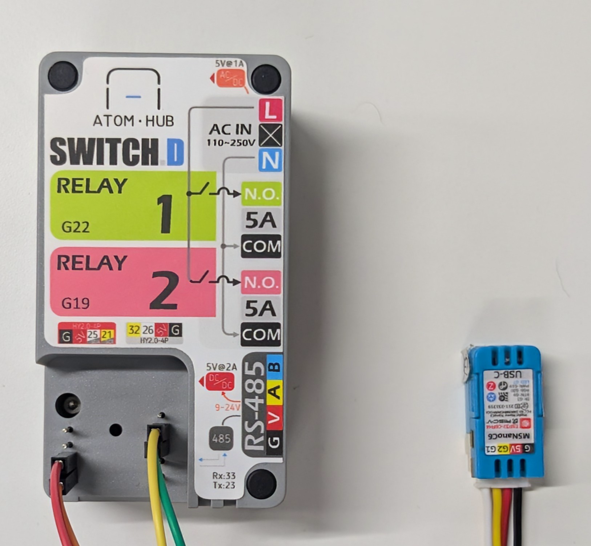

# Socket | 2 Channel

## Description

A dual-channel smart socket featuring independent relay control, unified status indication via WS2812 RGB LED, and multi-button user interactions:

* **Dual Relay Control**: Independently controls two power channels via GPIO-connected relays
* **User Input**:
  * Dedicated single-button press toggles each socket state (Button1: Endpoint1, Button2: Endpoint2)
  * Long press on either button triggers factory reset
* **Unified Status Indication**: Single WS2812 RGB LED displays combined socket states and system events
* **Matter Data Model Specification**:
  * **Device Type** : `On/Off Plug`

## Hardware Configuration

The following hardware components are used for this product:

* **Devkit**: [M5Stack Nano C6 Dev Kit](https://shop.m5stack.com/products/m5stack-nanoc6-dev-kit?srsltid=AfmBOooXsbm_fgpDyK1yWqgPOwtjrL3WksxGlhmRKDZFmVj2omLLbWDX)
* **Power Relays**: Two single-channel relay
* **Indicator**: On-board WS2812 RGB LED
* **Buttons**: Two on-board or external push-buttons

### Pin Assignment

| Peripheral      | GPIO Pin | Function                  |
|-----------------|----------|---------------------------|
| Relay 1 Control | GPIO2    | Primary power switching   |
| Relay 2 Control | GPIO3    | Secondary power switching |
| Button 1        | GPIO9    | Primary socket control    |
| Button 2        | GPIO10   | Secondary socket control  |
| RGB LED         | GPIO8    | Unified status indication |

> **Note**: GPIO assignments can be customized by modifying the following macros in **app_driver.cpp**:
> `RELAY1_GPIO_NUM`, `RELAY2_GPIO_NUM`, `BUTTON1_GPIO_NUM`, `BUTTON2_GPIO_NUM`, `INDICATOR_GPIO_NUM`

## Understanding Code

### Initialization Sequence

The `app_driver_init()` function performs the following:

* Initializes both relay GPIOs as outputs
* Configures two independent buttons with debounce handling:
  * **Button1**: Toggles Endpoint1 (Socket1) on single-click
  * **Button2**: Toggles Endpoint2 (Socket2) on single-click
  * Both buttons trigger factory reset on long-press
* Initializes the WS2812 RGB LED for combined status indication

### Core Functions

* **Power Control**:
  * `app_driver_toggle_socket_state_button_callback` handles both endpoints using `endpoint_id` parameter
  * `app_driver_set_socket_state` manages relay states individually while providing unified LED feedback
  * State changes are reported to the system with proper endpoint differentiation

* **Visual Indicators**:
  * `LOW_CODE_EVENT_SETUP_MODE_START`: starts blinking effect, to indicate setup mode activation (2000ms interval)
  * `LOW_CODE_EVENT_SETUP_MODE_END`: stops blinking effect, to indicate setup mode has ended.
  * `LOW_CODE_EVENT_READY`: displays full brightness white light to indicate device is ready

### Multi-Endpoint Implementation

* Endpoint mapping:
  * Endpoint1 (ID=1): Controlled by Button1/RELAY1_GPIO_NUM
  * Endpoint2 (ID=2): Controlled by Button2/RELAY2_GPIO_NUM
* State tracking:
  * `socket_states[]` array maintains individual relay states
  * Button callbacks uses `endpoint_id` parameter for proper state management

### Extending Functionality

To add more relay channels to the system, implement the following changes:

* **Matter Data Model Extension**:
  * Add the required number of On/Off Plug Device Type endpoint to the Matter cluster configuration.
  * Run `Upload Configuration` command to upload the updated data model on the device.

* **Configure Additional Button Input**:
  * Initialize required GPIO button.
  * Register a **single-click event callback** using `button_driver_register_cb` for all the buttons.
  * Inside the callback:
    * Toggle the state of the second relay.
    * Report the new relay state to the system using `low_code_feature_update_to_system`.

## Related Documentation

* [Socket | 1 Channel](../socket/README.md)
* [Programmer's Model](../../docs/programmer_model.md)
* [Components](../../components/README.md)
* [Drivers](../../drivers/README.md)
* [Products](../README.md)
