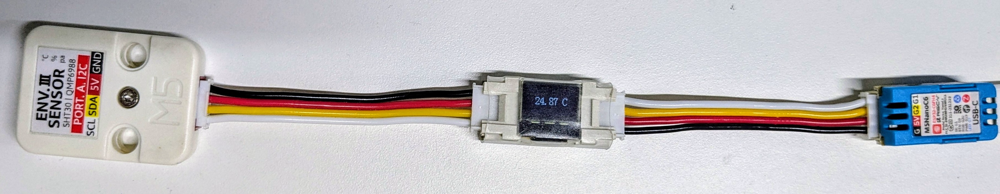

# Temperature Sensor (I2C Driver) | SHT30 Sensor + SSD1315 Display

## Description

Temperature monitoring system using SHT30 sensor with ssd1315 mini OLED display and reset button

* **Periodic Temperature Monitoring**: Measures ambient temperature using the I2C Driver SHT30 sensor and reports the data to the system every 10 seconds
* **Status Display**: The SSD1315 OLED display shows temperature readings and device status (setup mode, success/failure notifications)
* **Factory Reset via Button**: Long press (and release) of the configured button triggers a factory reset event
* **Matter Data Model Specification**:
  * **Device Type**: `Temperature Sensor`

## Hardware Configuration

The following components are used for this product:

* **Devkit**: [M5Stack Nano C6 Dev Kit](https://shop.m5stack.com/products/m5stack-nanoc6-dev-kit?srsltid=AfmBOooXsbm_fgpDyK1yWqgPOwtjrL3WksxGlhmRKDZFmVj2omLLbWDX)
* **Temperature Sensor**: [SHT30](https://shop.m5stack.com/products/env-iii-unit-with-temperature-humidity-air-pressure-sensor-sht30-qmp6988) (I2C Driver)
* **Display**: [SSD1315 mini OLED](https://docs.m5stack.com/en/unit/MiniOLED%20Unit) (compatible with SSD1306 driver)
* **Button**: Onboard boot button or external button

### Pin Assignment

| Peripheral      | Signal | ESP32-C6 GPIO |
|-----------------|--------|---------------|
| I2C (SHT30)     | SDA    | GPIO2         |
| I2C (SHT30)     | SCL    | GPIO1         |
| I2C (Display)   | SDA    | GPIO2         |
| I2C (Display)   | SCL    | GPIO1         |
| Button          | Input  | GPIO9         |

> **Note**: GPIO assignments can be modified by updating these macros in **app_driver.cpp**: `I2C_SDA_IO`, `I2C_SCL_IO`, `BUTTON_GPIO_NUM`

## Understanding Code

### Initialization Sequence

The `app_driver_init()` function performs:

* Configuring the button with debouncing
* I2C master initialization
* SSD1315 display setup
* SHT30 sensor initialization
* Creating a system timer that triggers every 10 seconds and calls `app_driver_read_and_report_feature()`

### Core Functions

* **Temperature Handling**:
  * Reads from SHT30 temperature sensor every 10 seconds
  * Displays formatted temperature (XX.XX °C) on ssd1315 display.
  * Reports to system periodically via `app_driver_report_temperature()`

* **Display Management**:
  * `app_driver_update_display()` handles text rendering
  * Supports two-line messages (split by newline)

* **Status Indicators**:
  * Setup mode: When in `setup mode` product alternates between displaying "Setup Mode" with temperature
  * Post-setup: Displays "Setup Success/Failed"

### Extending with Other I2C Sensors

To add support for any other I2C sensor, you can follow these steps:

* Initialize it in `app_driver_init()`
* Add reading logic in `app_driver_read_and_report_feature()`
* Implement a function to report its data

## Related Documents

* [Temperature Sensor (I2C Driver) | SHT30 Sensor](../temperature_sensor/README.md)
* [Programmer's Model](../../docs/programmer_model.md)
* [Components](../../components/README.md)
* [Drivers](../../drivers/README.md)
* [Products](../README.md)
