# LowCode Device Template

## Overview

This template provides a foundation for developing LowCode device. The architecture follows a standard setup/loop pattern with comprehensive event handling and feature management capabilities.

* **Matter Data Model Specification**: Only contains root node.

## Understanding Code

```mermaid
flowchart TD

    %% Setup Subgraph
    subgraph SETUP["🛠️ Setup"]
        A["🟢 System Initialization"]
        B["⚙️ Driver Configuration<br>(app_driver_init)"]
        A --> B
    end

    %% Event Handling Subgraph
    subgraph EV["📦 Event Handling"]
        D1["📥 System → Application<br>(event_from_system)"]
        D2["📤 Application → System<br>(low_code_event_to_system)"]
    end

    %% Feature Handling Subgraph
    subgraph FT["📦 Feature Handling"]
        E1["📥 System → Application<br>(feature_update_from_system)"]
        E2["📤 Application → System<br>(low_code_feature_update_to_system)"]
    end

    B --> C["🔁 Application Main Loop"]
    C --> EV & FT
    EV --> Loop["🔁 Loop"]
    FT --> Loop
```



This template follows a **`setup()` and `loop()` based execution model**.

### Initialization Phase

* The `setup()` function defined in **`app_main.cpp`** serves as the application’s entry point for initialization.
* Within `setup()`, the function **`app_driver_init()`** (defined in **`app_driver.cpp`**) is invoked.
* `app_driver_init()` encapsulates all driver and peripheral initialization logic, including configuration of relays, button input, and status indicators. In this template, these operations are abstracted or stubbed.

### Runtime Operation (`loop()` Execution)

* After initialization, the `loop()` function in **`app_main.cpp`** executes continuously.
* This function is responsible for monitoring asynchronous updates or events originating from the system or communication stack.

### System Event Handling

* When a system-originated update is received, one of the following handlers in `app_main.cpp` is invoked:
  * **`event_from_system()`**: Processes generic system events.
  * **`feature_update_from_system()`**: Handles specific feature-level updates (e.g., changes to device features or control states).
* Developers looking to extend behavior in response to system updates should implement their logic inside `feature_update_from_system()`.

### Reporting State to System

* To propagate any internal state change or event from the device to the system layer, use one of the following interfaces:
  * **`low_code_feature_update_to_system()`**: Used to notify the system of feature changes.
  * **`low_code_event_to_system()`**: Used to report discrete event occurrences (e.g., trigger factory reset).
* These functions act as the outbound interface to synchronize device state with the Matter data model and system.

### Using `low_code_feature_update_to_system()`

The `low_code_feature_update_to_system()` API is used to send feature updates from the application to the system. It supports two methods of identifying the feature to be updated:

1. **Using `feature_id`**: Provide a valid `feature_id` in the `low_code_feature_data_t` structure.
2. **Using Matter identifiers**: If `feature_id` is not yet mapped, the `low_level (low_code_feature_details_t)` can still be used to specify the required Matter-specific identifiers:
   * `cluster_id`
   * `attribute_id`

This approach offers flexibility for integrating with Matter-based systems, using either high-level feature IDs or direct low-level identifiers.

The following code snippet demonstrates how to send a feature update using `feature_id`:

```cpp
bool on_off_state = true;

low_code_feature_data_t feature = {
    .details = {
        .endpoint_id = 1,
        .feature_id = LOW_CODE_FEATURE_ID_POWER
    },
    .value = {
        .type = LOW_CODE_VALUE_TYPE_BOOLEAN,
        .value_len = sizeof(bool),
        .value = (uint8_t*)&on_off_state,
    },
};

low_code_feature_update_to_system(&feature);
```

The following code snippet demonstrates how to send a feature update using Matter-specific identifiers via the `low_level` field when a `feature_id` is not available:

```cpp
bool on_off_state = true;

low_code_feature_data_t feature = {
    .details = {
        .endpoint_id = 1,
        .feature_id = LOW_CODE_FEATURE_ID_UNHANDLED,  // feature_id is unhandled
        .low_level = {
            .matter = {
                .cluster_id = 0x0006,     // OnOff cluster
                .attribute_id = 0x0000   // OnOff attribute
            }
        }
    },
    .value = {
        .type = LOW_CODE_FEATURE_TYPE_BOOL,
        .value_len = sizeof(bool),
        .value = (uint8_t*)&on_off_state     // true
    },
    .priv_data = NULL
};

low_code_feature_update_to_system(&feature);
```

## Related Documentation

* [Programmer's Model](../../docs/programmer_model.md)
* [Components](../../components/README.md)
* [Drivers](../../drivers/README.md)
* [Products](../README.md)
