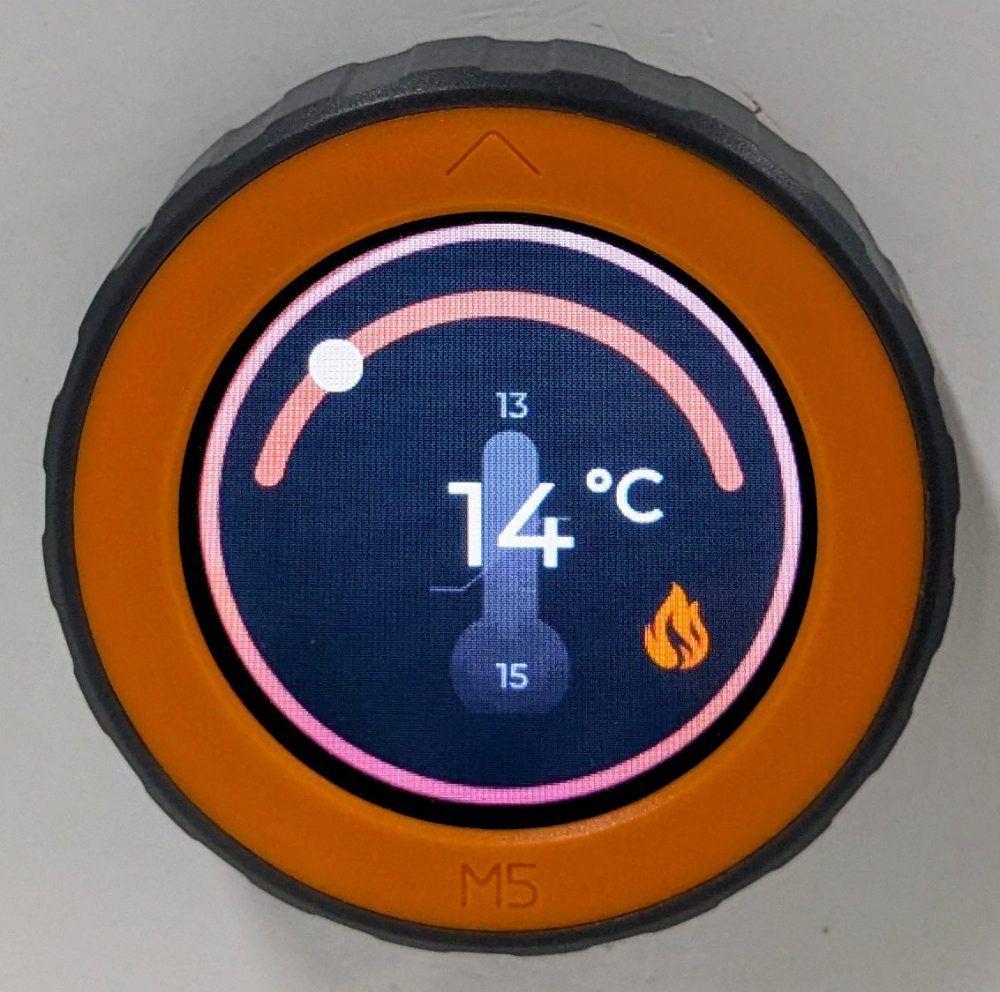

# Thermostat (Template) | Heating + Cooling

## Description

A template for implementing a Matter-compatible thermostat control with:

* **Temperature Management**:
  * Current temperature monitoring
  * Independent heating/cooling setpoint control
* **Matter Data Model Specification**:
  * **Device Type**: `Thermostat`
  * **Additional Features**: `Heating` & `Cooling`.

## Hardware Requirements

While this is currently a template, implementing a complete solution would require:

* **Microcontroller**: ESP32-C6

## Implementation Guide

* The `app_driver_init()` function in **app_driver.cpp** handles the initialization of all necessary drivers.
* In `feature_update_from_system()` function in **app_main.cpp**, the following driver callbacks are invoked to handle thermostat-related feature updates received from the system:
  * `app_driver_set_temperature()` – intended to set the target temperature.
  * `app_driver_set_cooling_setpoint()` – intended to set the cooling setpoint.
  * `app_driver_set_heating_setpoint()` – intended to set the heating setpoint.

> **Note**: These driver callbacks are only template placeholders and do not contain any actual thermostat driver logic or implementation.

## Related Documentation

* [Template](../template/README.md)
* [Temperature Sensor | SHT30](../temperature_sensor/README.md)
* [Programmer's Model](../../docs/programmer_model.md)
* [Components](../../components/README.md)
* [Drivers](../../drivers/README.md)
* [Products](../README.md)
